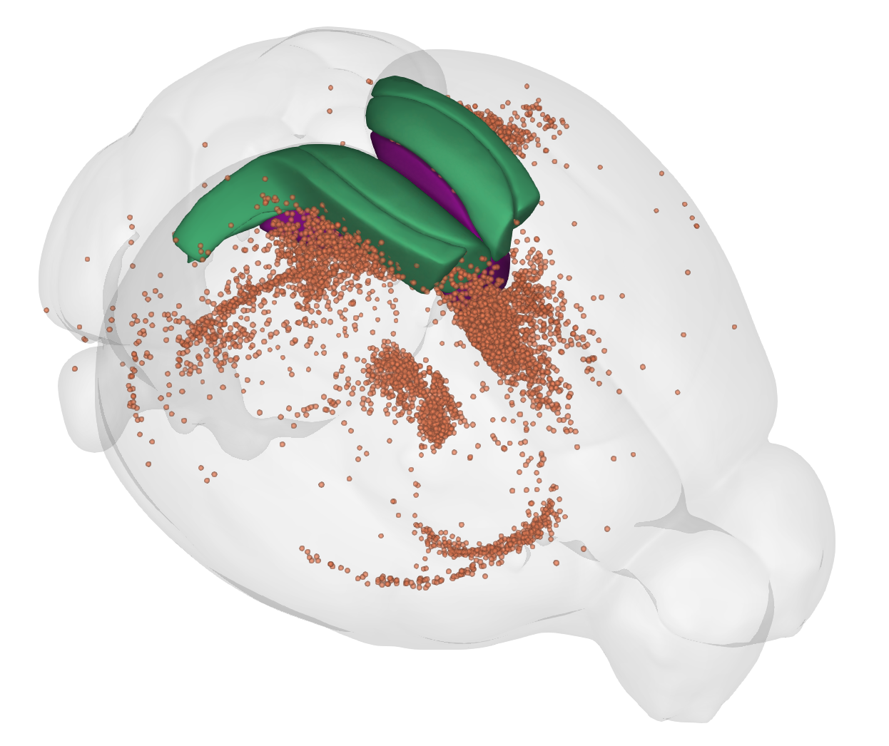

# Cellfinder
Whole-brain cell detection, registration and analysis.

---

Cellfinder is a collection of tools from the 
[Margrie Lab](https://www.sainsburywellcome.org/web/people/troy-margrie) and
 others at the [Sainsbury Wellcome Centre](https://www.sainsburywellcome.org/web/)
 for the analysis of whole-brain imaging data such as 
 [serial-section imaging](https://sainsburywellcomecentre.github.io/OpenSerialSection/)
 and lightsheet imaging in cleared tissue.
 
 The aim is to provide a single solution for:
 
 * Cell detection (initial cell candidate detection and refinement using 
 deep learning).
 * Atlas registration (using [amap](https://github.com/SainsburyWellcomeCentre/amap-python))
 * Analysis of cell positions in a common space
 
Installation is with 
`pip install cellfinder`, 
but full documentation can be 
found [here](https://sainsburywellcomecentre.github.io/cellfinder).
 
This software is at a very early stage, and was written with our data in mind. 
Over time we hope to support other data types/formats. If you have any 
questions or issues, please get in touch by 
[email](mailto:adam.tyson@ucl.ac.uk?subject=cellfinder), 
[gitter](https://gitter.im/cellfinder/community) or by 
[raising an issue](https://github.com/SainsburyWellcomeCentre/cellfinder/issues/new/choose).

---
## Examples
*more to come*

##### Tracing of inputs to retrosplenial cortex (RSP)
Input cell somas detected by cellfinder, aligned to the Allen Reference Atlas, 
and visualised in [brainrender](https://github.com/brancolab/brainrender) along 
with RSP.

Data courtesy of Sepiedeh Keshavarzi and Chryssanthi Tsitoura. [Details here](https://www.youtube.com/watch?v=pMHP0o-KsoQ)